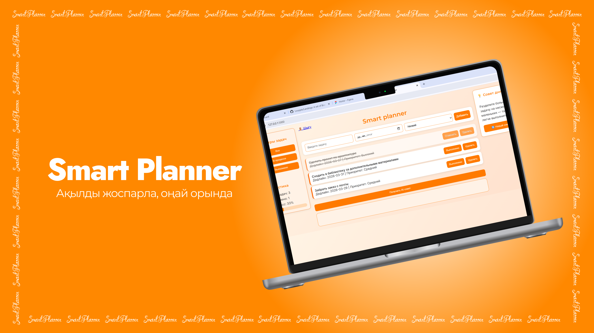

#  Smart Planner

Бұл — пайдаланушыларға арналған қарапайым веб-жоспарлаушы (task planner).
Жоба Flask арқылы backend жазуды және frontend-пен байланысты түсіну үшін жасалған.
Сонымен қатар, жобаға жасанды интеллект (AI) қолдану мүмкіндігі қосылған.

##  Функционалы:

Қосымшада келесі мүмкіндіктер бар:

-  Тіркелу және жүйеге кіру
-  Жаңа тапсырма қосу
-  Тапсырманы өшіру
-  Тапсырманы орындалды деп белгілеу
-  Тапсырмаларды сүзу:
-  AI блогы
-  Автоматты есептеу
-  Прогресс жолағы (progress bar)

##  Жасанды интеллект (AI):

Интерфейсте AI үшін бөлек бөлім қарастырылған.

Қазіргі уақытта:

- Пайдаланушы сұраныс жібере алады
- Жауап ала алады

Оны келесі мақсатта қолдануға болады:

- Тапсырмалар құру
- Жоспарлау бойынша кеңес алу
- Жүктемені талдау

Қазіргі функционал базалық деңгейде, әрі қарай дамытуға болады.

##  Қолданылған технологиялар:
- **Backend:** Python + Flask
- **Frontend:** HTML, CSS, JavaScript
- **Дерекқор:** SQLite
- **AI:** API арқылы интеграция

##  Жоба құрылымы:

project/

│

├── app.py

├── tasks.db

│

├── templates/

│   ├── index.html

│   ├── login.html

│   └── register.html

│

├── static/

│   ├── style.css

│   └── script.js

│

└── kod.txt

##  Қалай жұмыс істейді:

1. Пайдаланушы тіркеліп, жүйеге кіреді
2. Тапсырмаларды қосып, басқарады
3. Frontend Flask серверіне сұраныс жібереді
4. Сервер деректерді өңдеп, SQLite-пен жұмыс істейді
5. AI сұраныстары backend арқылы өңделеді

##  Жоба туралы:

Бұл жоба келесі нәрселерді үйрену үшін жасалды:

- Flask-пен жұмыс
- Дерекқормен жұмыс істеу
- Frontend пен backend байланысы
- Веб-қосымшаға AI қосу негіздері

##  Болашақта қосуға болады:
- Категориялар
- Толыққанды AI көмекші
- Мобильді нұсқа
- Интерфейсті жақсарту
